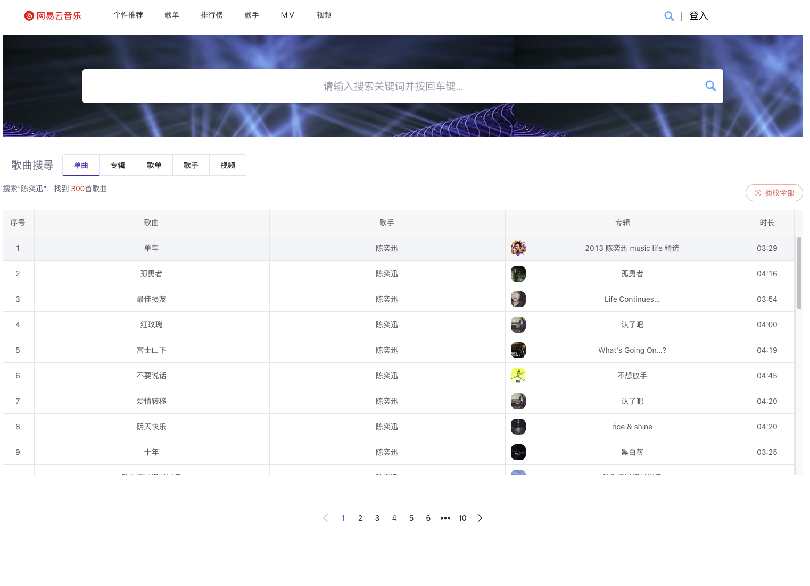
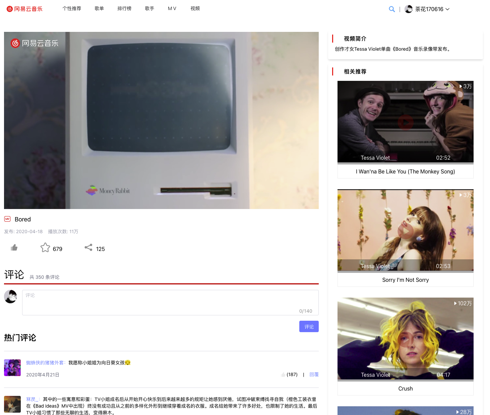

# vue3-music

## 若要在网上发布,请注明出处,谢谢!

## 線上瀏覽
[線上體驗音樂網](https://vue-cloud-music-psi.vercel.app/)
## 介绍 
  【vue全家桶練習項目】仿網易雲音樂客戶端，目前實現了頁面基本樣式，播放，歌詞，歌單，專輯，歌手，視頻，搜索，登錄，收藏，查看評論等基礎功能。

<html>
    <table style="margin-left: auto; margin-right: auto;">
        <tr>
            <td>
             <input checked type="checkbox"> 個性推薦
                
            </td>
            <td>
            <input checked type="checkbox"> 評論
                
            </td>
        </tr>
        <tr>
            <td>
            <input checked type="checkbox"> 登入
                
            </td>
            <td>
            <input checked type="checkbox"> 播放器
                
            </td>
        </tr>
        <tr>
         <td>
            <input checked type="checkbox"> MV
                
            </td>
             <td>
            <input checked type="checkbox"> 登入
                
            </td>
        </tr>
        <tr>
         <td>
            <input checked type="checkbox"> 歌單
                
            </td>
             <td>
            <input checked type="checkbox"> 歌單內容
                
            </td>
        </tr>
        <tr>
         <td>
            <input checked type="checkbox"> 搜尋
                
            </td>
             <td>
            <input checked type="checkbox"> 搜尋跳窗
                
            </td>
        </tr>
        <tr>
         <td>
            <input  checked type="checkbox"> 歌手列表
                
            </td>
             <td>
            <input checked type="checkbox"> 歌手詳情
                
            </td>
        </tr>
        <tr>
         <td>
            <input  checked type="checkbox"> 排行榜
                
            </td>
             <td>
            <input checked type="checkbox"> 使用者資訊
                
            </td>
        </tr>
        <tr>
         <td>
            <input  checked type="checkbox"> 排行榜
                
            </td>
             <td>
            <input checked type="checkbox"> 視頻詳情
                
            </td>
        </tr>
    </table>
</html>


## 運行步驟

```shell
$ yarn install

$ yarn dev
```

